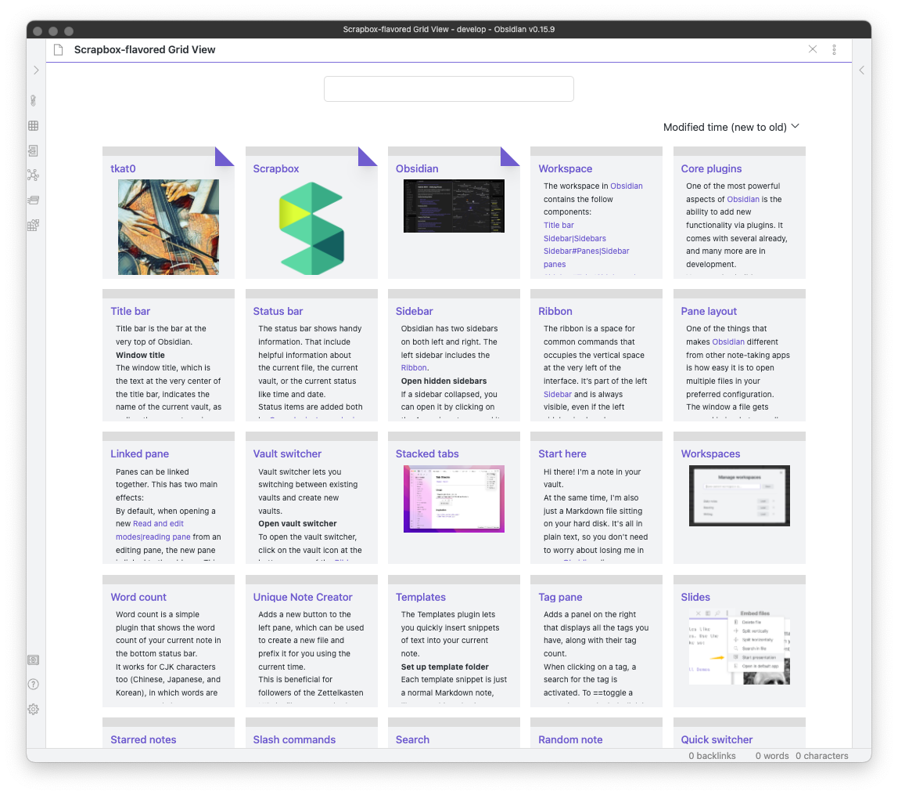
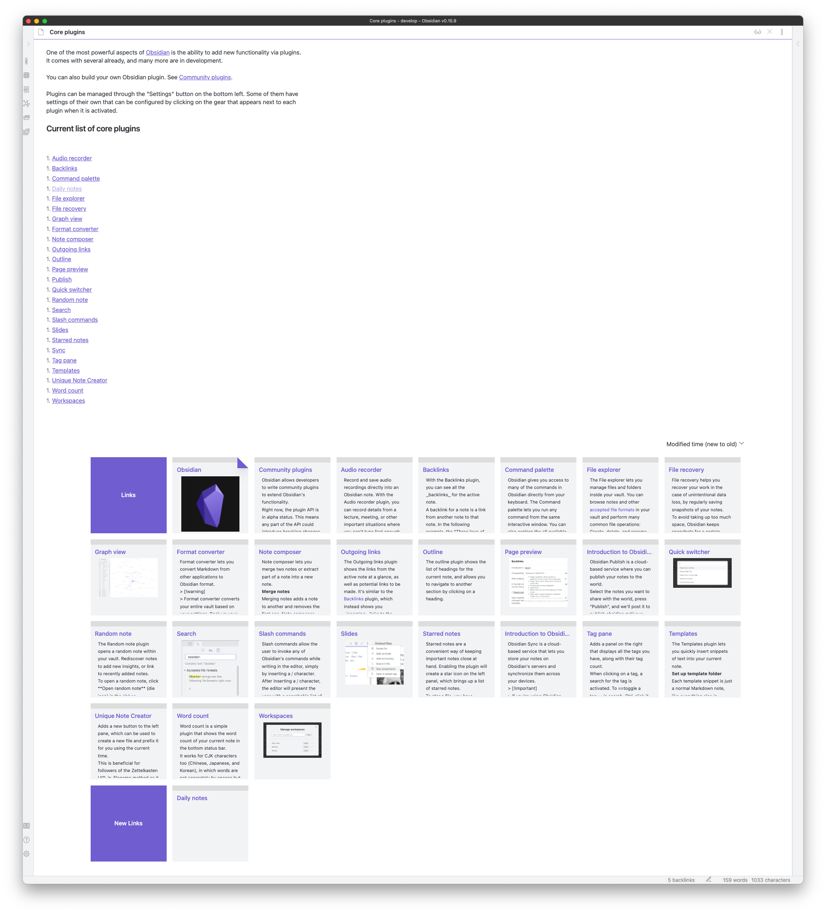
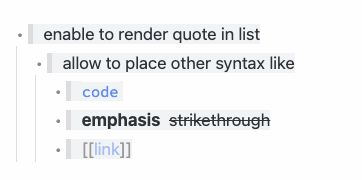

# Obsidian Scrapbox Flavored

[Scrapbox](https://scrapbox.io/product)-flavored Grid View and Outliner for [Obsidian](https://obsidian.md)

**Note:** This plugin is still in early alpha and is subject to change at any time!

## Features

### Grid View

Show files as cards with a thumbnail or a description

Command:

-   **Open Scrapbox-flavored Grid View** (default: <kbd>Command</kbd> + <kbd>Shift</kbd> + <kbd>g</kbd>)

You can explore pages in your vault efficiently.

Grid View provides several features.

- Search files by file path or tags
- Sort files
- Pin starred files (Enable `Starred` Core plugin to use this)
- Context menu to delete a file or toggle star

### Related Pages

Show cards related to the current page at the bottom of the page

### [Experimental] Styles

Provide Scrapbox flavored syntax.

This feature is disabled in default. Enable it in the setting.

<table>
<thead>
<tr>
<th>Style</th>
<th>Screenshot</th>
</tr>
</thead>
<tr>

<tr>
<td>
quote in list
</td>
<td>

</td>
</tr>

<tr>
<td>
<a href="https://scrapbox.io/help-jp/Helpfeel%E8%A8%98%E6%B3%95">helpfeel</a> in list
</td>
<td>

</td>
</tr>

### [Experimental] Outliner

Provide an effective list operations

This feature is disabled in default. Enable it in the setting.

The hotkeys can not be changed now.

<table>
<thead>
<tr>
<th>Command (hotkey)</th>
<th></th>
</tr>
</thead>
<tr>

<tr>
<td>
<li><b>Create a list</b> (<kbd>Tab</kbd> or <kbd>Space</kbd>)</li>
<li><b>Delete a list</b> (<kbd>Shift</kbd> + <kbd>Tab</kbd> or <kbd>Backspace</kbd>)</li>
</td>
<td>

</td>
</tr>

<td>
<ul>
<li><b>Move cursor to the beginning of the line</b> (default: <kbd>Ctrl</kbd> + <kbd>a</kbd>)</li>
<li><b>Move cursor to the end of the line</b> (default: <kbd>Ctrl</kbd> + <kbd>e</kbd>)</li>
</ul>
</td>
<td>

</td>

</tr>
<tr>
<td>
<li><b>Move up the current block of the list</b> (default: <kbd>Option</kbd> + <kbd>↑</kbd>)</li>
<li><b>Move down the current block of the list</b> (default: <kbd>Option</kbd> + <kbd>↓</kbd>)</li>
</td>
<td>

</td>
</tr>

<tr>
<td>
<li><b>Indent the selected block of the list</b> (default: <kbd>Option</kbd> + <kbd>→</kbd>)</li>
<li><b>Outdent the selected block of the list</b> (default: <kbd>Option</kbd> + <kbd>←</kbd>)</li>
</td>
<td>

</td>
</tr>
</table>

## How to use

This plugin has not been released officially yet.

### BRAT

If you use BRAT (Beta Reviewers Auto-update Tester), you can try the plugin to specify `tkat0/obsidian-scrapbox-flavored`.

See [TfTHacker/obsidian42-brat: BRAT - Beta Reviewer's Auto-update Tool for Obsidian. Part of the Obsidian42 family of plugins.](https://github.com/TfTHacker/obsidian42-brat) for details

### Copy manually
-   Download `main.js`, `manifest.json` and `styles.css` from [Releases](https://github.com/tkat0/obsidian-scrapbox-flavored/releases)
-   Copy them to your vault `VaultFolder/.obsidian/plugins/obsidian-scrapbox-flavored`
-   Enable this plugin in the Obsidian configuration.

### Build manually
-   Download this repository
-   Run `pnpm install && pnpm run build`
-   Copy over `./packages/plugin/{main.js, manifest.json, styles.css}` to your vault `VaultFolder/.obsidian/plugins/obsidian-scrapbox-flavored`
-   Enable this plugin in the Obsidian configuration.

## Roadmap

These features will be implemented.

- data sync to Scrapbox
    - import Scrapbox pages to Obsidian
    - export Obsidian pages to Scrapbox
- code block in Markdown list like https://scrapbox.io/help/Syntax#58348ae2651ee500008d67df

## Related projects

Scrapbox and Markdown parser used in this plugin

- [tkat0/scrapbox-converter: Scrapbox to Markdown parser written in Rust](https://github.com/tkat0/scrapbox-converter)

Obsidian Plugins of Scrapbox-like grid view

-   [yo-goto/obsidian-card-view-mode: Obsidian Card View Mode Plugin](https://github.com/yo-goto/obsidian-card-view-mode)
-   [qawatake/obsidian-card-view-switcher-plugin: An Obsidian plugin to provide a quick switcher with card view](https://github.com/qawatake/obsidian-card-view-switcher-plugin)

Obsidian Plugins of Scrapbox-like list operation

-   [vslinko/obsidian-outliner: Work with your lists like in Workflowy or RoamResearch](https://github.com/vslinko/obsidian-outliner)

## Acknowledgements

### Scrapbox

This project was created based on [Scrapbox](https://scrapbox.io/product).
Thank you for creating the great product.
