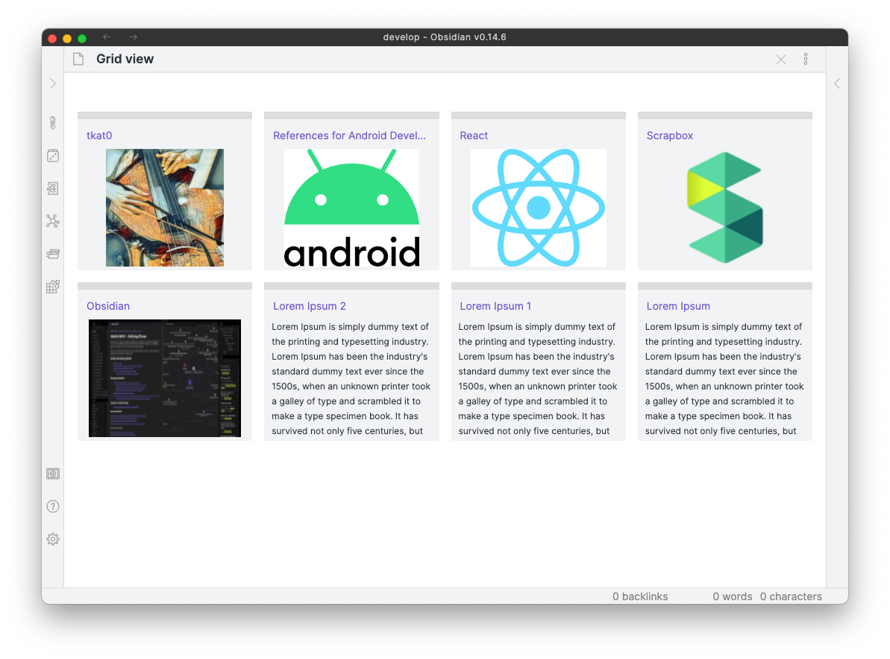
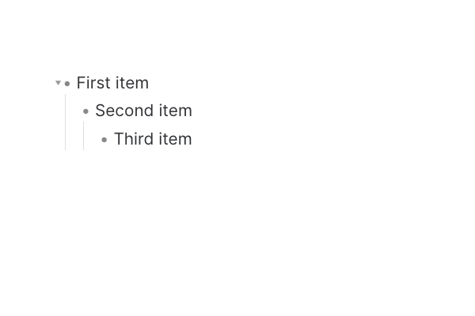
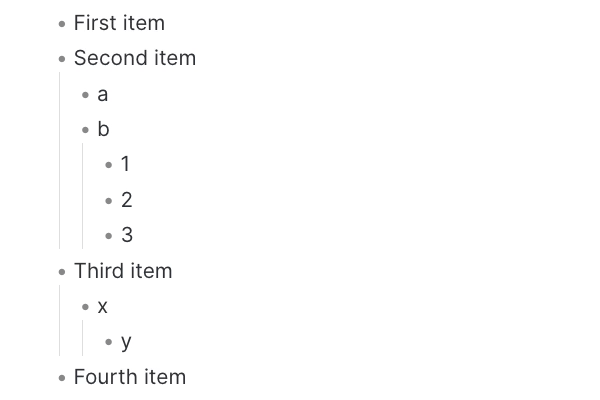
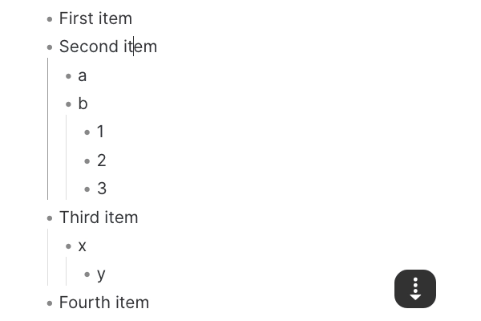

# Obsidian Scrapbox Flavors

[Scrapbox](https://scrapbox.io/product)-flavored grid view and efficient list operations for [Obsidian](https://obsidian.md)

**Note:** This plugin is still in early alpha and is subject to change at any time!

## Features

### Grid view

Show cards with a image or a description (default: <kbd>Command</kbd> + <kbd>s</kbd>)

### List operations

<table>
<thead>
<tr>
<th>Command (default hotkey)</th>
<th></th>
</tr>
</thead>
<tr>

<td>
<ul>
<li><b>Move cursor to the beginning of the line</b> (default: <kbd>Ctrl</kbd> + <kbd>a</kbd>)</li>
<li><b>Move cursor to the end of the line</b> (default: <kbd>Ctrl</kbd> + <kbd>e</kbd>)</li>
</ul>
</td>
<td>

</td>

</tr>
<tr>
<td>
<li><b>Move up the current block of the list</b> (default: <kbd>Option</kbd> + <kbd>↑</kbd>)</li>
<li><b>Move down the current block of the list</b> (default: <kbd>Option</kbd> + <kbd>↓</kbd>)</li>
</td>
<td>

</td>
</tr>

<tr>
<td>
<li><b>Indent the selected block of the list</b> (default: <kbd>Option</kbd> + <kbd>→</kbd>)</li>
<li><b>Outdent the selected block of the list</b> (default: <kbd>Option</kbd> + <kbd>←</kbd>)</li>
</td>
<td>

</td>
</tr>
</table>

## How to use

This plugin is not registered as a community plugin yet.
If you want to try, follow the following steps.

-   Download this repository
-   Copy over `main.js`, `manifest.json` to your vault `VaultFolder/.obsidian/plugins/obsidian-scrapbox-flavors/`
-   Enable this plugin in the Obsidian configuration.
-   Execute command `Scrapbox flavors: Open grid view` or open it from the sidebar icon

## Related plugins

Scrapbox-like grid view

-   [yo-goto/obsidian-card-view-mode: Obsidian Card View Mode Plugin](https://github.com/yo-goto/obsidian-card-view-mode)
-   [qawatake/obsidian-card-view-switcher-plugin: An Obsidian plugin to provide a quick switcher with card view](https://github.com/qawatake/obsidian-card-view-switcher-plugin)

Scrapbox-like list operation

-   [vslinko/obsidian-outliner: Work with your lists like in Workflowy or RoamResearch](https://github.com/vslinko/obsidian-outliner)
